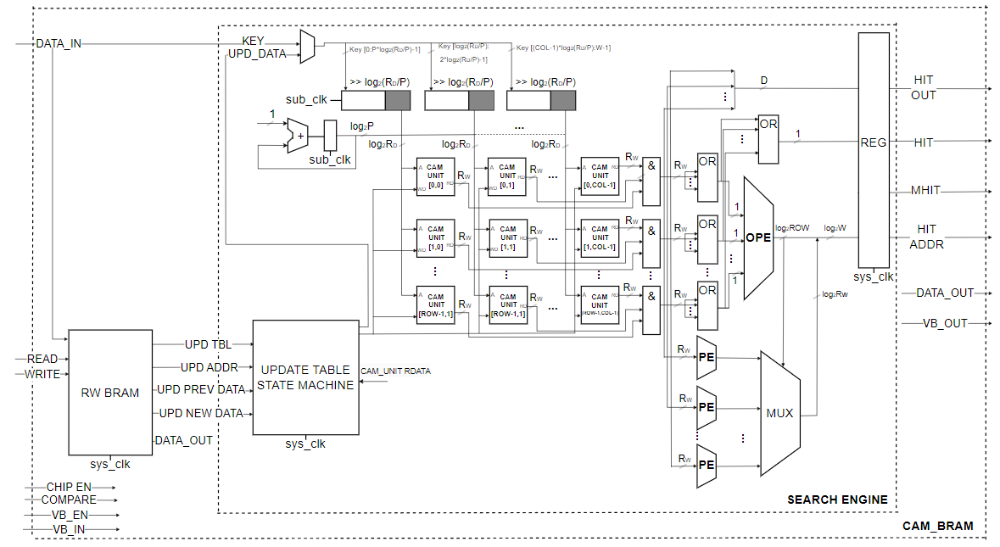

# CAM (Content Addressable Memory) память на основе Xilinx BRAM
Цель: разработка эффективной по утилизации ресурсов CAM памяти для FPGA прототипа

Особенности:
- Эмулирует функционал XXXXXX
- Вход sub_clk должен иметь частоту в 2 раза больше, относительно входа clk. Данные клоки должны быть полностью синхронны между собой, т.к. пересинхронизации нет
- Задержка обновления таблицы при операции записи - 5 тактов

## Принцип работы
Идея хранения CAM на основе BRAM в том, что глубину CAM памяти определяет ширина BRAM памяти. А ширина CAM определяется адресным входом BRAM памяти.

Основная концепция эффективной утилизации памяти заключается в умножении рабочей частоты BRAM на коэффициент P относительно системной, на которой работает остальная логика. По умолчанию коэффициент P = 2 (но может быть и больше - 4,8). Коэффициент задается параметром в топ-левле блока.

Источник лежавший в основе данной архитектуры: I.Ullah, Z.Ullah, Jeong-A Lee. "Efficient TCAM Design Based on Multipumping-Enabled Multiported SRAM on FPGA".

## Структурная схема

